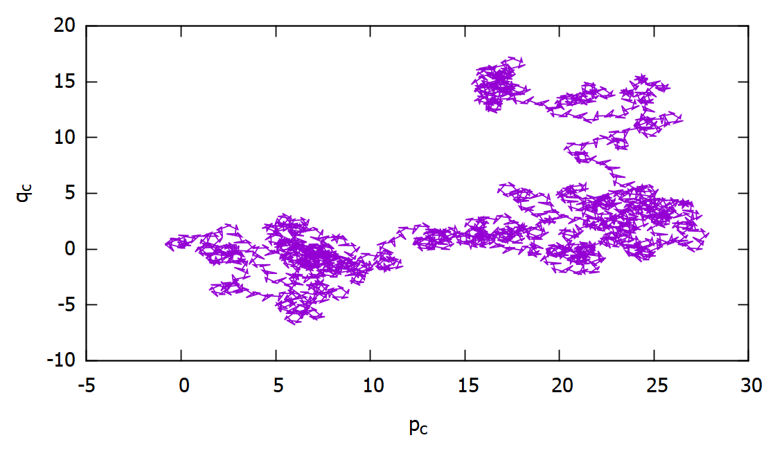
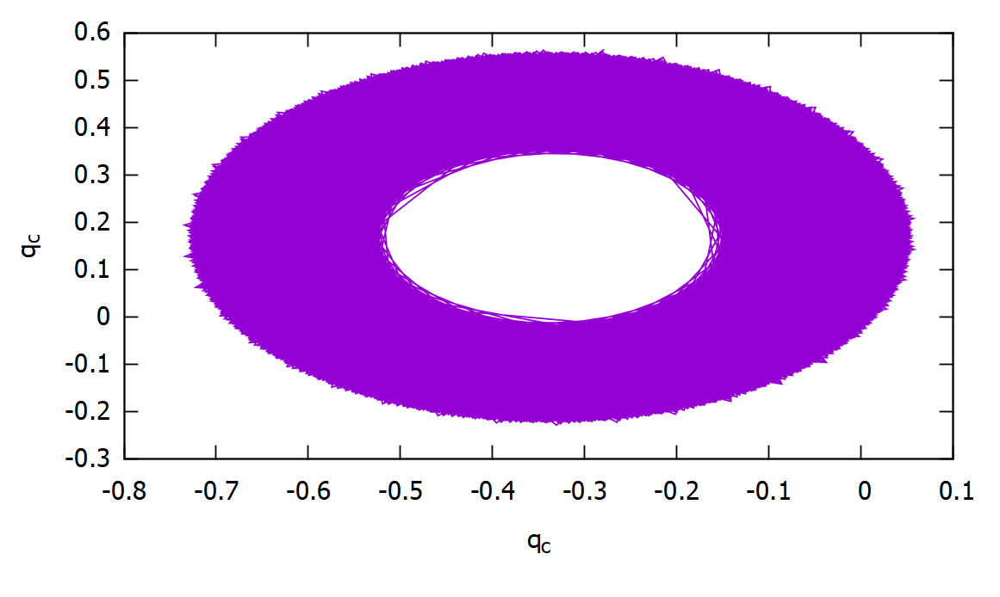
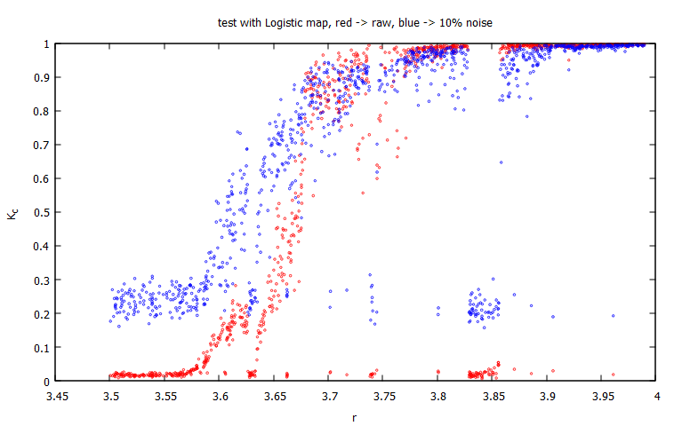

```cpp
#include "01-test.h"
int main() {
    Test01 test;
    test.init(dat);
    test.make_test();
    //double k=test.get_value();
    //cout<<"01-test: "<<k<<endl;
    test.print_pcqc();
    return 0;
}
```
# Dinámica en el espacio Pc-Qc de una serie de tiempo caótico



# Dinámica en el espacio Pc-Qc de una serie de tiempo no caótico



# Comparación raw vs raw + noise


$k_c \approx 1$ fuerte evidencia de caos